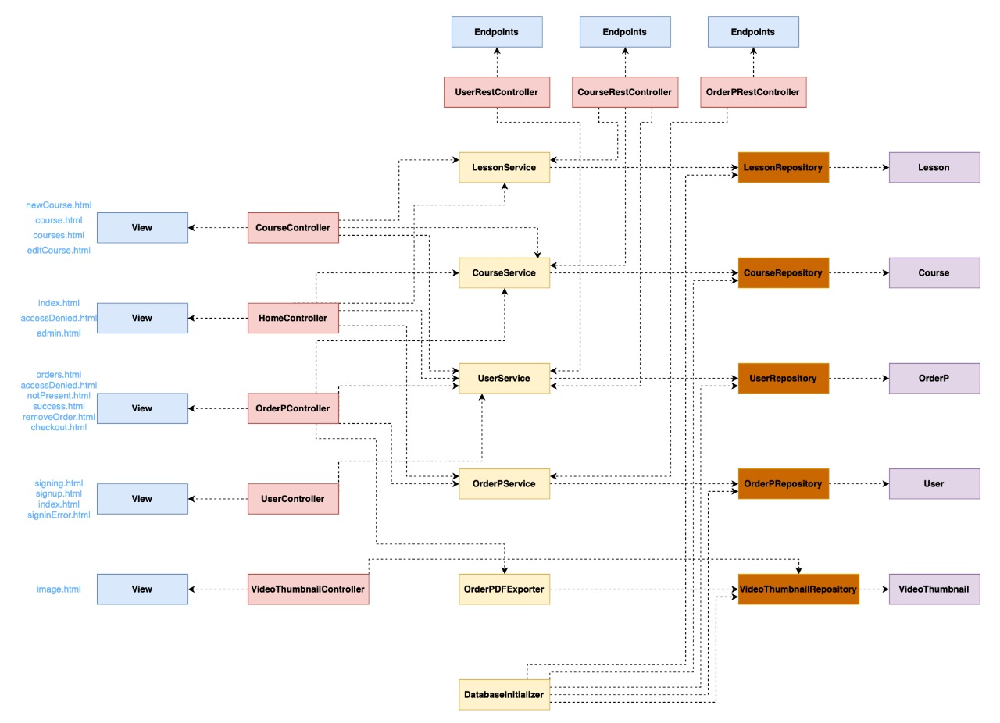
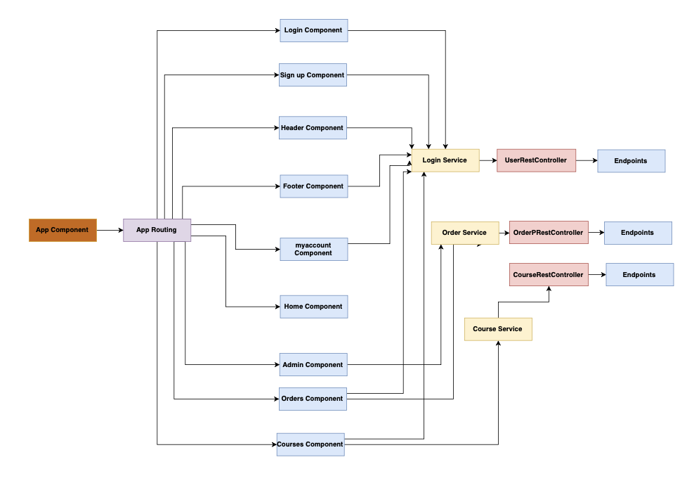

# Youdemy

Youdemy is a teching platform that empowers teachers to upload unlimited content divided by courses and lessos so that students across the world can access these resources.

## Table of contents

- [Programmers](#Programmers)
- [PHASE 0: APLICATION FUNCTIONALITIES](#PHASE-0:-APLICATION-FUNCTIONALITIES)
  - [Entities](#ENTITIES)
- [Users](#Users)
  - [USER PERMISSION](#USER-PERMISSION)
- [Additional Technology](#Additional-Technology)
- [Advanced Algorithm](#Advanced-Algorithm)
- [DIAGRAMS](#DIAGRAMS)
  - [Navigation Diagram](#Navigation-Diagram)
  - [Class Diagram](#Class-Diagram)
  - [Database Diagram](#Database-Diagram)
- [CONTRIBUTIONS](#CONTRIBUTIONS)
  - [Emiliano Sloth](#Emiliano-Sloth)
  - [Fiorella Hernández](#Fiorella-Hernández)
  - [José Manuel de Pablo](#José-Manuel-de-Pablo)
  - [Oscar Arranz Pato](#Oscar-Arranz-Pato)
- [Start coding](#Start-coding)
- [Requirements](#Requirements)

## Programmers

| Name                           |  Email  |    Github  |
|--------------------------------| ------------- | ----- |
| Emiliano Sloth                 | e.sloth.2022@alumnos.urjc.es  | emslmar |
| Oscar Arranz                   | o.arranz.2019@alumnos.urjc.es | OscarArranz |
| Jose Manuel De Pablo Cobo      | jm.depablo@alumnos.urjc.es | pablocjm |

## PHASE 0: APLICATION FUNCTIONALITIES

### ENTITIES

Our application has 4 different entities
* **USER** - The applications users. There are different types of users in our application:
  * Student
  * Teacher
  * Aministrator 
* **COURSE** - This entity represents a course that only a teacher has permission to create.
* **LESSONS** - This entity represents the lessons that are within a course each with their own information and are created at the time of creating and editing a course. 
* **ORDER** - This entity represents the purchasing process of a user and it stores the information of what courses are owned by what users. 

## Users
Within the user entity there are different types of users;

* **GUEST** - is the type of user that doesnt sign up for an account and has only access to view the course catalog and the main description of courses.
* **STUDENT** - is the type of user that signs up for a student account and has the additional option of purchasing courses and accessing the lessons within the course.
* **TEACHER** - Teachers are the creators within the application. They can create courses and lessons and upload or enter the information. They can also delete and edit the courses they own.
* **ADMINISTRATOR** - Administrators are able to edit or delete any course or lessons and they also have access to their dashboard where they can see all of the web application information.

### USER PERMISSION

Students
- Search Content
- Buy courses

Teachers
- Create courses
- Create different lessons inside the course
- Upload video url
- delete owned courses and lessons
- edit owned courses and lessons

Administrators
- Search Content
- Delete any course
- Edit any course
- Visualize stastistics
 

## Additional Technology

Generate a pdf with the order information so that user can download this information

## Advanced Algorithm 

Search algorithm for courses (ajax).

## Graphics
Administrators will be able to check visual information about courses

## Screens

The application consists of the following screens:

## DIAGRAMS

### Navigation Diagram
The following diagram shows how users can navigate through the different pages of the application according to their role.

### Class Diagram
The following diagram shows the different classes in our web application.

### Database Diagram
The following diagram shows our database infrastructure/schema.

## CONTRIBUTIONS

### Emiliano Sloth 
  - Restful Error Handling
  - User Authentication
  - CRF Handling
  - User Creation
  - HTTPS
  - Modify Course Information
  - Delete Course and Lessons within Course
  - Teacher allowed to Modify their own content

### José Manuel de Pablo 
  - Order Handling (Create, Delete).
  - Checkout step from course page to finish order.
  - Order info to PDF file.
  - Listing Orders to PDF file.
  - Users only can see their own orders.
  - Admin dashboard listing entities.
  - Update database schema.
  - My account page

### Oscar Arranz Pato
  - Course creation
  - Lesson creation
  - AJAX course loading
  - Course search

## Start coding
Follow these steps to get working:

1. Clone the repo `git clone https://github.com/CodeURJC-DAW-2021-22/webapp10`.
2. Navigate to backend folder `cd ./webapp10/backend`.
3. Install the project dependencies `mvn clean install`.
4. Run the project `mvn exec:java -Dexec.mainClass=com.youdemy.YoudemyApplication`.

## Requirements
- [Java 17](https://openjdk.java.net/projects/jdk/17/) - Java 17 OpenJDK
- [Maven](https://maven.apache.org/) - Maven webpage

## Angular

### Class Diagram 
The following diagram shows the doifferent components and services created for the Angular Frontend of the application.

### Member Participation Angular

Emiliano Sloth
| Number                           |  Task  |    Commit  |
|--------------------------------| ------------- | ----- |
| 1        | Register Functionality | [comit1](https://github.com/CodeURJC-DAW-2021-22/webapp10/commit/d1888ca914937b795ff21d96d94dfa3ec765de6a)
| 2        | Login Functionality | [comit2](https://github.com/CodeURJC-DAW-2021-22/webapp10/commit/d1888ca914937b795ff21d96d94dfa3ec765de6a)
| 3        | Header Component | [comit3](https://github.com/CodeURJC-DAW-2021-22/webapp10/commit/d1888ca914937b795ff21d96d94dfa3ec765de6a)
| 4        | Footer Component | [comit4](https://github.com/CodeURJC-DAW-2021-22/webapp10/commit/d1888ca914937b795ff21d96d94dfa3ec765de6a)
| 5        | Login Service | [comit5](https://github.com/CodeURJC-DAW-2021-22/webapp10/commit/d1888ca914937b795ff21d96d94dfa3ec765de6a)

Oscar Arranz
| Number                           |  Task  |    Commit  |
|--------------------------------| ------------- | ----- |
| 1        | Courses Component | [comit1](https://github.com/CodeURJC-DAW-2021-22/webapp10/commit/d1888ca914937b795ff21d96d94dfa3ec765de6a)
| 2        | Course Service | [comit2](https://github.com/CodeURJC-DAW-2021-22/webapp10/commit/d1888ca914937b795ff21d96d94dfa3ec765de6a)
| 3        | Pagination | [comit3](https://github.com/CodeURJC-DAW-2021-22/webapp10/commit/d1888ca914937b795ff21d96d94dfa3ec765de6a)
| 4        | Graph | [comit4](https://github.com/CodeURJC-DAW-2021-22/webapp10/commit/d1888ca914937b795ff21d96d94dfa3ec765de6a)
| 5        | Images | [comit5](https://github.com/CodeURJC-DAW-2021-22/webapp10/commit/d1888ca914937b795ff21d96d94dfa3ec765de6a)

Jose Manuel De Pablo Cobo 
| Number                           |  Task  |    Commit  |
|--------------------------------| ------------- | ----- |
| 1        | Order Component | [comit1](https://github.com/CodeURJC-DAW-2021-22/webapp10/commit/d1888ca914937b795ff21d96d94dfa3ec765de6a)
| 2        | OrderP Service | [comit2](https://github.com/CodeURJC-DAW-2021-22/webapp10/commit/d1888ca914937b795ff21d96d94dfa3ec765de6a)
| 3        | Heroku | [comit3](https://github.com/CodeURJC-DAW-2021-22/webapp10/commit/d1888ca914937b795ff21d96d94dfa3ec765de6a)
| 4        | Docker | [comit4](https://github.com/CodeURJC-DAW-2021-22/webapp10/commit/d1888ca914937b795ff21d96d94dfa3ec765de6a)
| 5        | Profile | [comit5](https://github.com/CodeURJC-DAW-2021-22/webapp10/commit/d1888ca914937b795ff21d96d94dfa3ec765de6a)

### Video demo

[Youdemy Youtube](https://youtu.be/kC6k4rKjWf0)

